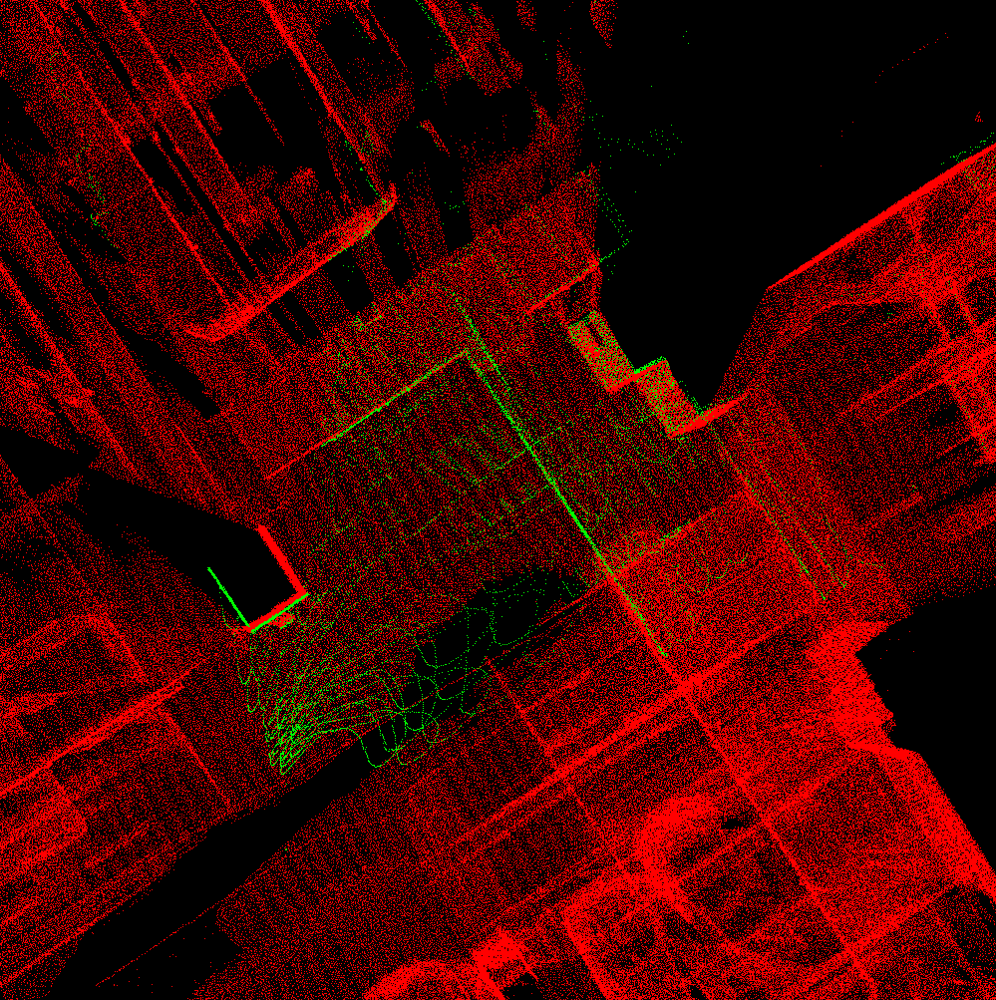
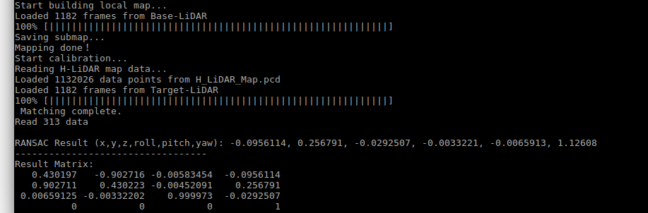

# Livox 外参自动标定工具v0.1　快速参考手册

## 简介
本工具提供了用于Livox多雷达之间的外参自动标定方法，适用于Mid，Horizon系列激光雷达。

   
**图１.** 红色点云：基准雷达建图结果, 绿色点云: 自动标定中的目标雷达点云

## 依赖库
Cmake, PCL1.7, Eigen
建议直接安装ROS，包含了以上的库

```
sudo apt-get install ros-kinetic-cv-bridge ros-kinetic-tf ros-kinetic-message-filters ros-kinetic-image-transport

```
## 编译

```

mkdir build
cd build
cmake ..
make

```

生成三个文件，分别是**mapping**, **calibration**, **fitline**　  

* **mapping:** 可视化建图工具　　

* **calibration:** 可视化自动标定工具　　

* **fitline:**　拟合标定参数，计算最终参数矩阵　　


## 运行
### **1.准备双雷达标定pcd数据**　　

* 基准雷达数据放在	data/Base_LiDAR_Frames/.pcd (以 100000.pcd 作为第一帧文件名，后续帧往上累加)  

* 待标定雷达数据放在	data/Target_LiDAR_Frames/.pcd (以 100000.pcd 作为第一帧文件名，后续帧往上累加)  

* 粗配准外参矩阵放在	data/Init_Matrix.txt  

**注意**：基准雷达数据和待标定雷达数据需要尽可能在时间上同步，文件名和时间戳为同步对应。

 **示例数据下载**  
 [**Target-LiDAR-Frames**](https://terra-1-g.djicdn.com/65c028cd298f4669a7f0e40e50ba1131/Showcase/Target-LiDAR-Frames.tar.gz)  
 [**Base_LiDAR_Frames**](https://terra-1-g.djicdn.com/65c028cd298f4669a7f0e40e50ba1131/Showcase/Base_LiDAR_Frames.tar.gz)  

### **2.运行**
```
cd livox_calibration
cp run.sh build/
cd build
sh run.sh

```
脚本首先启动可视化建图程序**mapping**，用基准雷达建立子地图，建立完成后启动标定程序**calibration**，完成标定参数估计工作，最后启动
参数拟合器**fitline**，完成最终参数矩阵计算。

 
**图２．** 样例数据的自动标定结果输出

## **注意：**  
* 必须保证双雷达数据同步  
* 基准雷达建图必须尽可能准确  
* 采集车、平台运动必须尽可能缓慢，数据建议进行运动畸变修正以保证最终的精度  
* 粗配准外参数矩阵不必要很精准，但需要大致能够对齐，尽可能保证最终的精度。  
* 对于Mid-40, Horizon型号，转换的PCD文件参照100ms为一帧。  

## 标定数据采集要求

1.在移动采集数据期间，需要保证基准雷达LiDAR0在移动的时间段t内扫描的区域（重建的地图）能够被其余雷达所探测，需要保证最小的探测盲区。建议采用原地旋转或者”0”字形轨迹运动进行完全的场景扫描。

2.采集数据的环境，尽量选用宽敞的室内或者地下车库，能够保证有较好的地图重建精度，地图完整度与特征丰富度（需注意Livox的探测盲区问题）。避免选用室外空旷，无明显几何结构特征且移动目标（车辆行人）较多的场景。采集数据时候避免四周有移动物体（注意切勿有人在围观或者跟随运动）。否则容易导致建图失败或者建图误差过大，影响后续的配准标定。

3.移动采集时尽量保证运动的缓慢，特别时是转弯处，遵循慢速、大半径过弯原则，最小化运动畸变。

4.传感器数据要保证同步，建议采用Livox HUB进行数据的获取。

5.雷达的安装不局限于有重叠可视区域，可以任意安装，只要能够保证获取外参初值即可。

6.采集格式无要求，可以是rosbag或者lvx，只需要能够按每帧100ms转换为多帧pcd文件即可。

## 参考标定过程

1.找到合适的场地，确定标定的路线，软硬件的准备。因为我们需要提供一个外参的初值（重要！），有两种方式，第一是直接把外参初值写在雷达中然后采数据，这样获得的点云数据直接是带有外参初值的，程序中使用的初值提供单位矩阵即可；第二是把雷达中的外参清空后采数据，这样点云数据是雷达自身坐标系下的，然后在程序中对应的地方提供初值外参矩阵即可，这里外参初值获取可以用机械设计参考值或者手工测量值。

2.开始录制对应的rosbag或者lvx，注意不同的雷达数据需要保存不同的topic。所以在录制rosbag或者在lvx转rosbag的时候，需要在对应的launch文件（比如录制是livox_hub_rviz.launch；转换是lvx_to_rosbag.launch）里面把 multi_topic 参数设置成1，这样可以把不同的雷达数据保存成不同的topic，或者把一个lvx文件中不同的雷达保存成不同的topic。开始录制后开始缓慢的走一圈标定路线，走完后结束录制即可。

3.将雷达数据转化成对应的一帧一帧pcd文件（lvx可以通过lvx_to_rosbag.launch转换，参考 https://github.com/Livox-SDK/livox_ros_driver ），注意两个雷达之间需要时间同步，同样名称的pcd文件需要对应同一个时刻的数据。然后根据readme文档里面的要求把对应的pcd文件放在不同的文件夹下然后执行程序即可。

4.编译，运行代码，输出最终标定结果。

## 标定结果的验证
有两种验证方式可以参考：
1.雷达有overlap情况，可以在标定结束，参数写入后，用livox viewer观察overlap区域是否存在错层，如果错层较大，说明标定结果错误，建议修改外参初值，确认地图建立的精度以后，重新进行标定和验证。
2.雷达无overlap情况，将targer雷达的点云使用标定结果外参旋转后，融合到base雷达点云（merge操作）。将融合后的点云存为pcd，运行mapping节点进行建图，观察建图结果。如果建图结果存在错层，说明标定结果错误，建议修改外参初值，确认地图建立的精度以后，重新进行标定和验证。

**Developer: [Livox](https://www.livoxtech.com/)**

